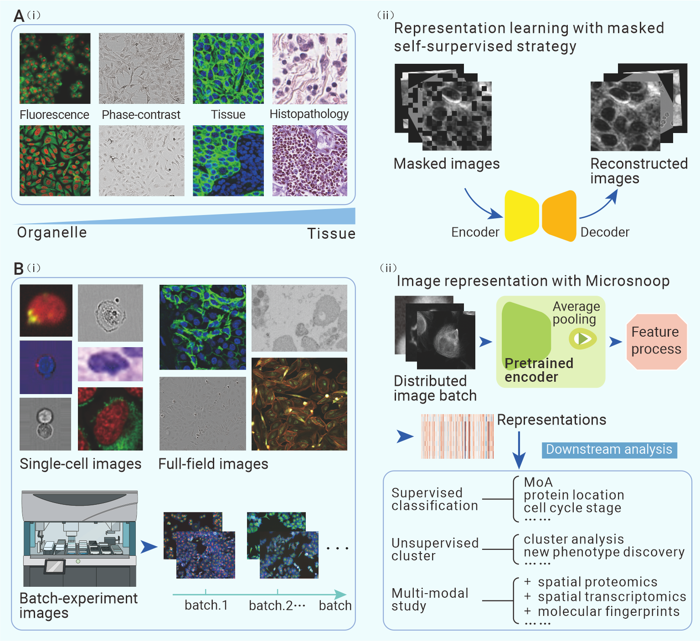
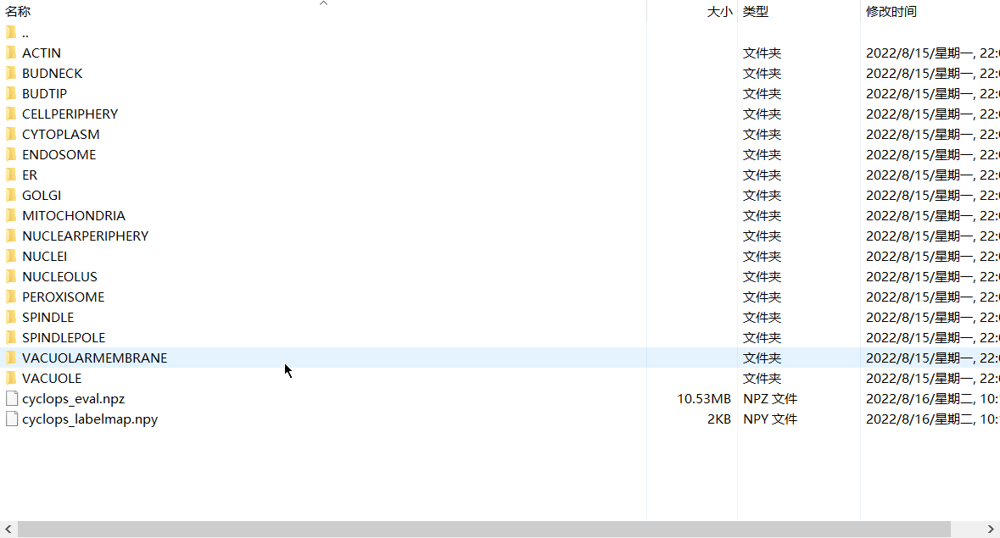
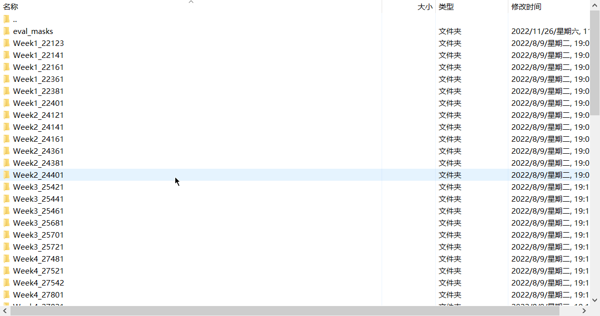

# Microsnoop

A generalist tool for the unbiased representation of heterogeneous microscopy images

### **Description**

Automated and accurate profiling of microscopy images from small-scale to high-throughput is becoming an essential procedure in basic and applied biological research. Here, we present Microsnoop, a novel deep learning-based representation tool trained on large-scale microscopy images using masked self-supervised learning, which eliminates the need for manual annotation. Microsnoop is able to unbiasedly profile a wide range of complex and heterogeneous images, including single-cell, fully-imaged and batch-experiment data. We evaluated the performance of Microsnoop using seven high-quality datasets, containing over 358,000 images and 1,270,000 single cells with varying resolutions and channels from cellular organelles to tissues. Our results demonstrate Microsnoop's robustness and state-of-the-art performance in all biological applications, outperforming previous generalist and even custom algorithms. Furthermore, we presented its potential contribution for multi-modal studies. Microsnoop is highly inclusive of GPU and CPU capabilities, and can be freely and easily deployed on local or cloud computing platforms.

### Overview of Microsnoop


**Fig. 1 | Design of Microsnoop for microscopy image representation. a,** Schematic of the learning process. (i) Example of the four main category images are shown. The channels range from cellular organelles to tissues. (ii) A masked self-supervised learning strategy was employed and only images are required for training without additional manual annotation. One-channel masked images were set as the input and the Encoder- Decoder were required to reconstruct the original images. **b,** At test time, (i) Example images from various downstream tasks are shown, with different resolutions, number of channels and image types. These microscopy images are categorized into 3 types to ensure the broad coverage of image profiling needs. (ii) Application of Microsnoop. Each batch of images is fed into the pre-trained encoder, and the output smallest convolutional maps are processed by average pooling. Then, all extracted embeddings are processed according to different profiling tasks. The potential downstream analyses of our generalist representation tool are shown in the panel.

### System requirements

**Operating system:** It has been tested on Ubuntu. Theoretically, it can work on any system that can run Python.

**Software dependencies:** 

Python --3.7，CUDA --11.6， GPU --NVIDIA GeForce RTX 3090

Note: we did not test on a device without a GPU, so it is better to ensure that a GPU is available.

This project uses the h5py, numpy, opencv-python, scipy, pandas, kneed, faiss, tqdm, scikit-learn, torch, scellseg packages. Go check them out if you don't have them, you can install them with conda or pip.

**Amazon Cloud Computing:**

A configured Amazon Machine Image (AMI) is available at Community AMIs. You can follow the following steps to quickly deploy Microsnoop for microscopy image analysis.

1. Launch instance from AMI: search and choose our AMI --- Microsnoop-publish-20230228.
2. Choose suitable hardware, e.g. CPU, GPU, storage.
3. Configure SSH: the name of our configured env is pytorch_latest_p37.
4. Map your local project to the deployment project.

### Usage

We provide examples of using Microsnoop for profiling single-cell (run_cyclops), fully-imaged (run_tissuenet), and batch-experiment  (run_bbbc021) images, corresponding data can be obtained at  https://figshare.com/articles/dataset/Microsnoop_a_generalist_tool_for_the_unbiased_representation_of_heterogeneous_microscopy_images/22197607. You can follow these examples to build your own process. Any questions on the use of the software can be contacted via Issues and we will reply promptly.

Steps to run Microsnoop on the example datasets:

1. Download this project.

2. Download and unzip the example datasets:

   **Note:** 
   
   a. The raw images of CYCLoPs need to be downloaded from https://www.kaggle.com/datasets/stanleyhua/cyclops-protein-loc/. Copy the images into the 'example_datasets/cyclops' folder.  The final directory structure can be seen following:
   
   
   
   
   
   b. The raw images of BBBC021 need to be downloaded from https://bbbc.broadinstitute.org/BBBC021. Copy the images into the 'example_datasets/bbbc021' folder. The final directory structure can be seen following:
   
   
   
   
   
   
   Input the root dir of the example datasets. For example, if your dataset directory is ''/Data/datasets/cyclops', you can replace the original dataset_dir with '/Data/datasets' in run_cyclops.py:
   
   ```python
   dataset_dir = r'/Data/datasets'
   ```
   
3. Input the suitable batch_size  according to the available memory capacity of your GPU, and gen_size  according to the available memory capacity of your CPU.

   ```python
   args.batch_size = 16
   data_loader = eval_dataset.load_data(dataset_path, gen_size=1024)  # gen_size should be an integer multiple of the channel numbers
   ```

4. Configure the environment and run the script.

5. The output of Microsnoop is feature embeddings of each one-channel image in '.h5' format. You can read a '.h5' file through:

   ```python
   import h5py
   
   embed_path = r'/Data/microsnoop/output/embeddings/cyclops'  # input the path of the feature embeddings
   embeddings_file = h5py.File(embed_path)
   embeddings = embeddings_file['embeddings'][:]
   inds = embeddings_file['inds'][:]
   chans = embeddings_file['chans'][:]
   ```

   The path of these output embeddings is in folder 'output/embeddings'.

6. The run time for run the example scripts on our device (CPU: 192GB, GPU: NVIDIA GeForce RTX 3090) is:

   | Script           | Time    | batch_size | gen_size |
   | ---------------- | ------- | ---------- | -------- |
   | run_cyclops.py   | 9min    | 16         | 4096     |
   | run_tissuenet.py | 17min   | 64         | 200      |
   | run_bbbc021.py   | 3h16min | 96         | 300      |

   Different devices may take different amounts of time.

### Data availability

The new evaluation datasets generated by this study are available on figshare: https://figshare.com/articles/dataset/Microsnoop_a_generalist_tool_for_the_unbiased_representation_of_heterogeneous_microscopy_images/22197607.

### **Reference**

Our pipeline referred to the following projects:

CytoImageNet: https://github.com/stan-hua/CytoImageNet

MAE: https://github.com/facebookresearch/mae

Scellseg: https://github.com/cellimnet/scellseg-publish

CPJUMP1: https://github.com/jump-cellpainting/2021_Chandrasekaran_submitted

Cellpose: https://github.com/MouseLand/cellpose

DeepProfiler: https://github.com/broadinstitute/DeepProfilerExperiments/tree/master/bbbc021

MUSE: https://github.com/AltschulerWu-Lab/MUSE

